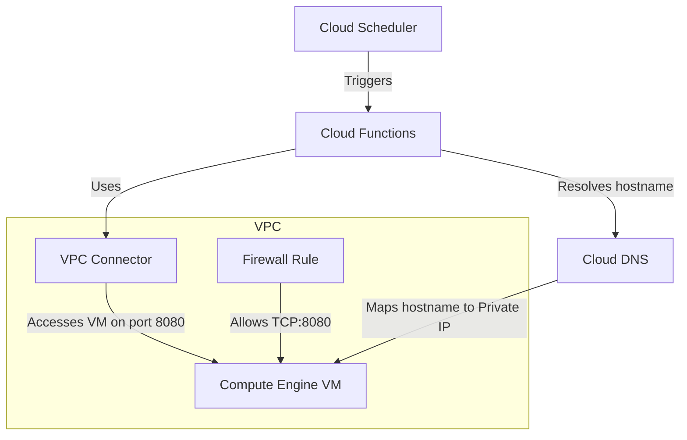

```mermaid
graph TD;
    cs[Cloud Scheduler] -->|Triggers| cf[Cloud Functions];
    cf -->|Uses| vpc-connector[VPC Connector];
    vpc-connector -->|Accesses VM on port 8080| vm[Compute Engine VM];
    cf -->|Resolves hostname| cloud-dns[Cloud DNS];
    cloud-dns -->|Maps hostname to Private IP| vm;
    firewall[Firewall Rule] -->|Allows TCP:8080| vm;

    subgraph VPC
        vpc-connector
        vm
        firewall
    end
```
