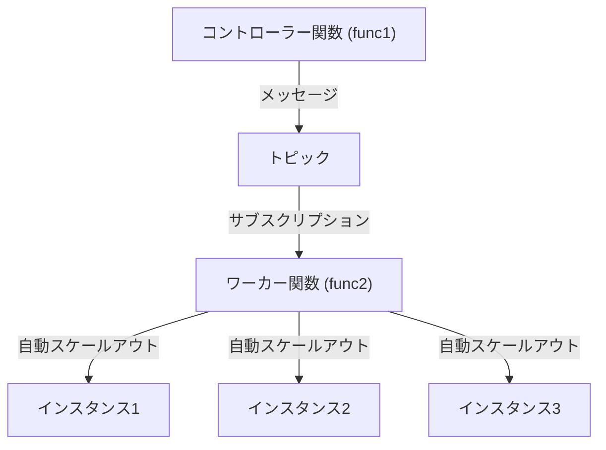

```mermaid
flowchart TD
    CF["コントローラー関数 (func1)"]
    CF -- "メッセージ" --> TP

    TP[トピック]
    TP -- "サブスクリプション" --> WF

    WF["ワーカー関数 (func2)"]
    WF -- "自動スケールアウト" --> I1
    WF -- "自動スケールアウト" --> I2
    WF -- "自動スケールアウト" --> I3

    I1[インスタンス1]
    I2[インスタンス2]
    I3[インスタンス3]
```
