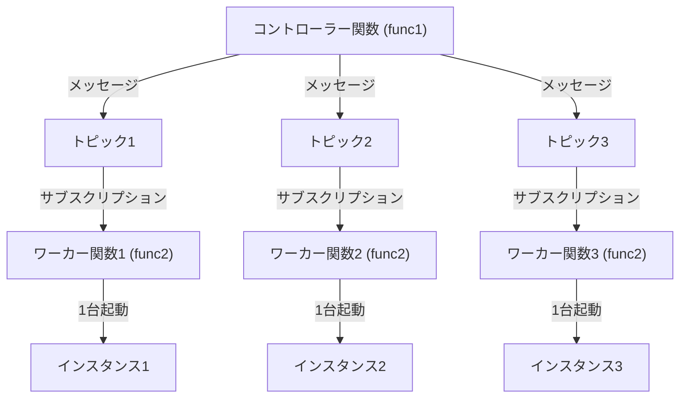

```mermaid
flowchart TD
    CF["コントローラー関数 (func1)"]
    CF -- "メッセージ" --> T1
    CF -- "メッセージ" --> T2
    CF -- "メッセージ" --> T3

    T1[トピック1]
    T2[トピック2]
    T3[トピック3]
    T1 -- "サブスクリプション" --> W1
    T2 -- "サブスクリプション" --> W2
    T3 -- "サブスクリプション" --> W3

    W1["ワーカー関数1 (func2)"]
    W2["ワーカー関数2 (func2)"]
    W3["ワーカー関数3 (func2)"]
    W1 -- "1台起動" --> I1
    W2 -- "1台起動" --> I2
    W3 -- "1台起動" --> I3

    I1[インスタンス1]
    I2[インスタンス2]
    I3[インスタンス3]
```
